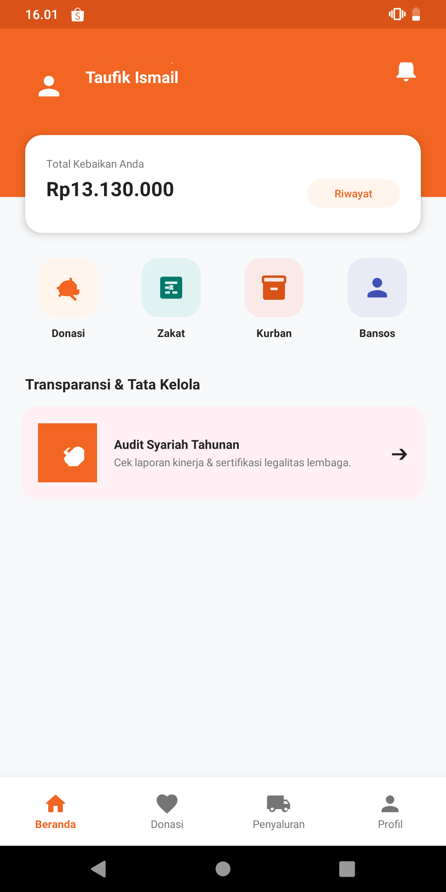
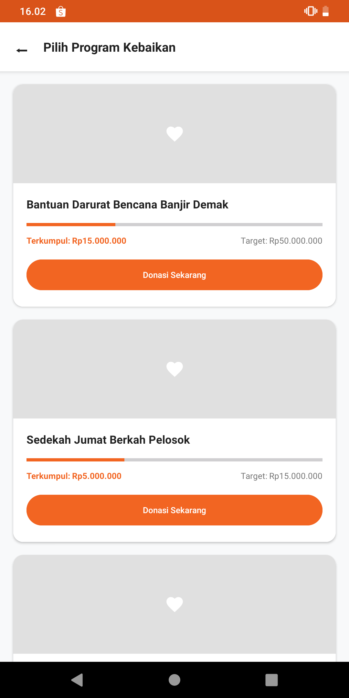
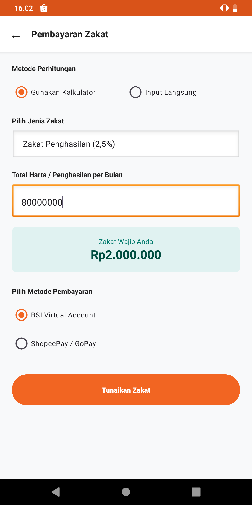
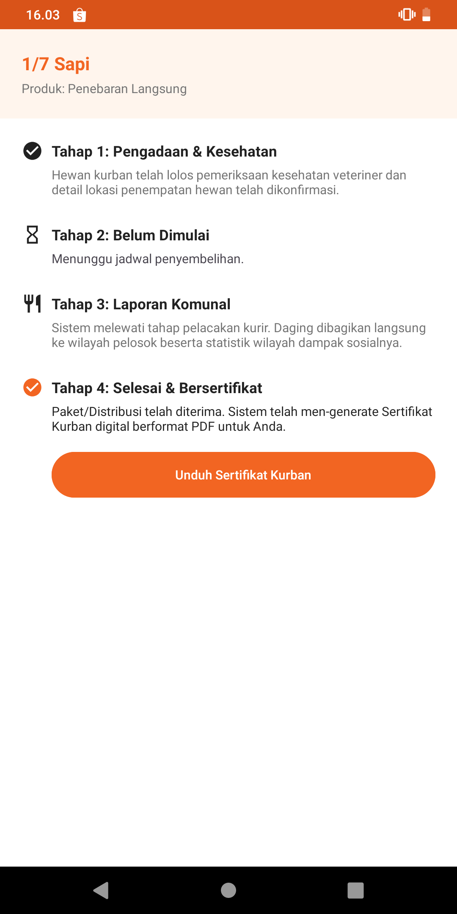
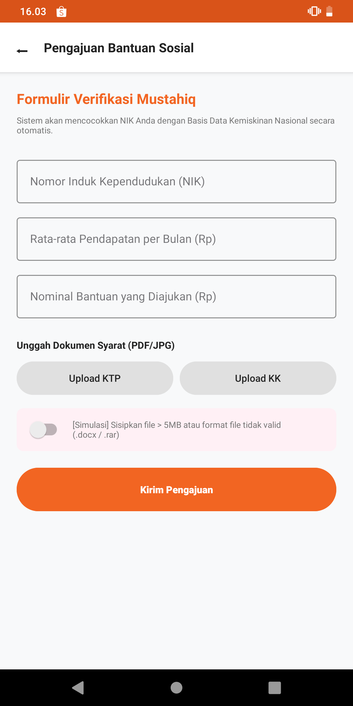
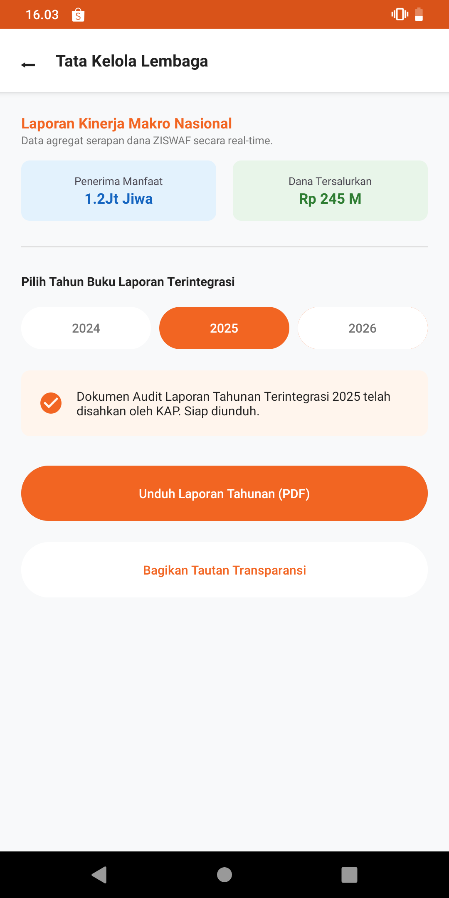

# Kelompok 4 - Aplikasi Rumah Zakat

Sebuah aplikasi berbasis Android Native yang dikembangkan untuk memenuhi tugas mata kuliah **Pemrograman Mobile 1** di **Universitas Teknologi Bandung (UTB)**. Aplikasi ini mendigitalkan proses penghimpunan dana Ziswaf (Zakat, Infak, Sedekah, Wakaf), pelacakan distribusi kurban, hingga pengajuan bantuan sosial (Bansos) dengan sistem verifikasi mandiri.

-----------------------------------------

## 👥 Tim Pengembang (Kelompok 4)

| Nama Lengkap | NPM | Peran dalam Proyek |
| :--- | :--- | :--- |
| Muhammad Ihsanuddin | 24552011330 | Frontend Developer (1) |
| Muhammad Nazriel Zildjian | 24552011331 | Frontend Developer (2) |
| Taufik Ismail | 24552011355 | Backend Developer |

---

## 🎥 Video Penjelasan Proyek

🔗 **[https://youtu.be/1fhKXXst9Zk](https://youtu.be/1fhKXXst9Zk)**

---

## 📱 Tangkapan Layar Aplikasi (Screenshots)

Berikut adalah antarmuka *Super-App* yang telah kami kembangkan menggunakan Android Material Design:

  
  &nbsp;&nbsp;&nbsp;&nbsp;
  
  &nbsp;&nbsp;&nbsp;&nbsp;
  
  
  
  

---

## ⚙️ Ringkasan Fitur

- **(Donasi & Kampanye):** Katalog kampanye dengan kalkulasi *progress bar* real-time, dukungan donasi anonim (Hamba Allah), perlindungan batas minimal transaksi, dan penerbitan e-Struk digital.
- **(Zakat & Pajak):** Kalkulator zakat otomatis dengan deteksi *Nishab*, opsi input manual, serta simulasi pengunduhan Bukti Setor Pajak (BSP).
- **(Pelacakan Kurban):** Visualisasi tahapan dari pengadaan, penyembelihan, hingga distribusi (Superqurban dan Penebaran Langsung) beserta penanganan kendala sistem/kurir.
- **(Bantuan Sosial):** Formulir verifikasi Mustahiq yang terintegrasi dengan filter *Desil Kemiskinan*, penolakan indikasi *fraud*, dan deteksi limit ukuran fail dokumen.
- **(Transparansi):** Dasbor tata kelola lembaga, informasi kinerja makro, dan fitur pengunduhan laporan audit tahunan terintegrasi dari KAP.

---

## 🚀 Cara Menjalankan (Cloning) Proyek

Proyek ini dibangun menggunakan **Kotlin** dan dioptimalkan untuk **Android Studio** dengan basis data lokal **SQLite**.

### Cara Cloning Proyek:
1. Buka CMD (Command Prompt) atau Terminal dan masuk ke folder yang akan menjadi tempat clone.
2. Salin link repository GitHub proyek ini.
3. Pada CMD, ketik perintah clone dengan cara: `git clone [tempel_link_github_disini]`
4. Lalu ketik: `cd RumahZakatApp-Kelompok4`
5. Pada CMD ketik `git checkout main`, karena versi final aplikasi berada di branch main.

### Cara Menjalankan di Android Studio:
1. Pada Android Studio, klik menu **File** di pojok kiri atas.
2. Lalu pilih **Open**.
3. Pilih folder yang tadi menjadi tempat cloning proyek.
5. Lalu pilih folder **app**.
4. Lalu tunggu hingga proses sinkronisasi Gradle selesai di latar belakang.
5. Jika Gradle sudah selesai, lakukan *running* aplikasi dengan cara mengaktifkan emulator (AVD) atau menyambungkan HP fisik.
6. Lalu klik tombol **Play (Run)** berwarna hijau di bagian atas menu Android Studio.

### Cara Menggunakan Aplikasi:
1. **Registrasi** terlebih dahulu pada halaman awal dengan memasukkan Nama Lengkap, Email, dan Password.
2. Jika sudah membuat akun, lalu **Login** menggunakan Email dan Password yang telah didaftarkan.
3. Jika Login berhasil, user akan diarahkan ke halaman **Beranda (Dashboard)** yang menampilkan Nama Pengguna dan Total Riwayat Donasi secara *real-time*.
4. Pada Dasbor, user dapat mengakses menu sesuai fungsionalitas sistem (Skenario Use Case):
   - **Menu Donasi (Infak):** User dapat melihat daftar kampanye dengan *progress bar* target dana, berdonasi secara anonim (Hamba Allah), serta mendapatkan e-Struk setelah pembayaran.
   - **Menu Zakat:** User dapat menghitung kewajiban zakat menggunakan kalkulator (dilengkapi filter batas *Nishab*) atau input manual, dan dapat mensimulasikan pengunduhan Bukti Setor Pajak (BSP).
   - **Menu Kurban:** User dapat melacak status pengadaan, penyembelihan, hingga distribusi kurban, serta mensimulasikan pengunduhan atau pengiriman Sertifikat Kurban via WhatsApp.
   - **Menu Bansos (Pengajuan Bantuan):** User dapat mengisi form bantuan dengan memasukkan NIK dan pendapatan. Sistem akan menyaring (screening) data otomatis berdasarkan standar Desil Kemiskinan Nasional, serta memvalidasi ukuran file dokumen.
   - **Menu Tata Kelola Lembaga (Transparansi):** User atau *Stakeholder* dapat memantau laporan makro kinerja lembaga dan mengecek ketersediaan Laporan Tahunan Audit KAP.
5. User dapat melihat jejak transaksinya melalui tombol **Riwayat** di Dasbor, dan dapat keluar dari sesi melalui menu **Profil -> Logout** di Navigasi Bawah.
